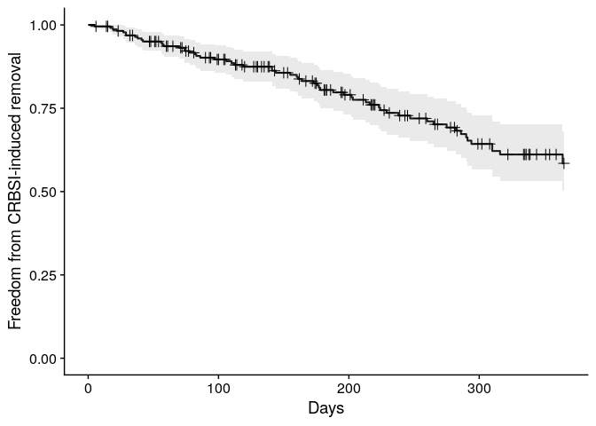
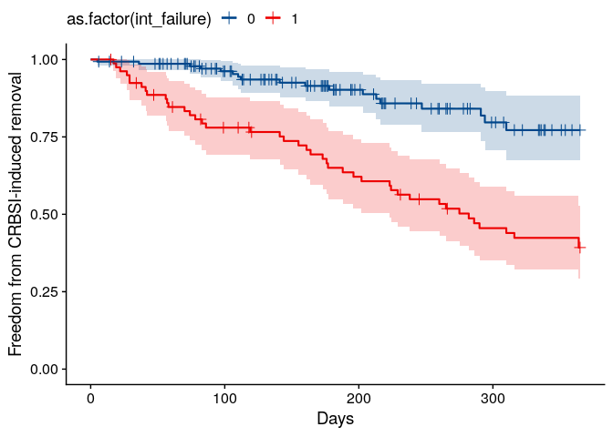
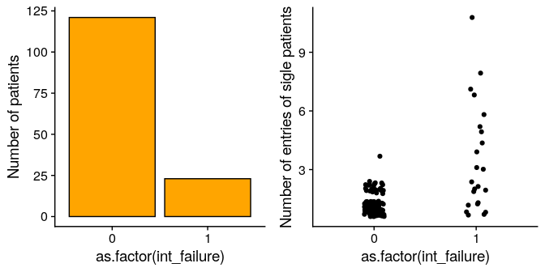
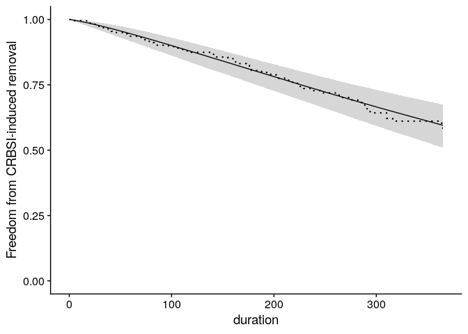
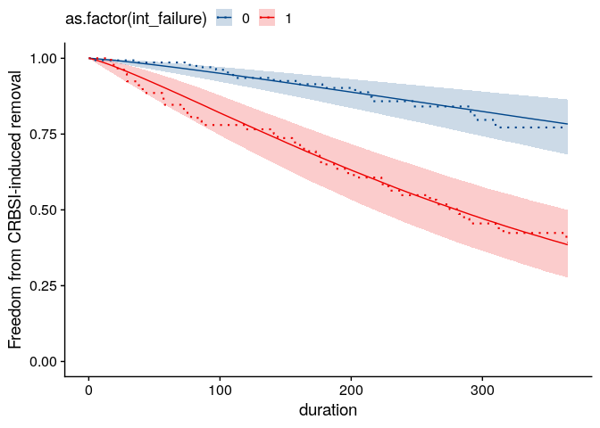
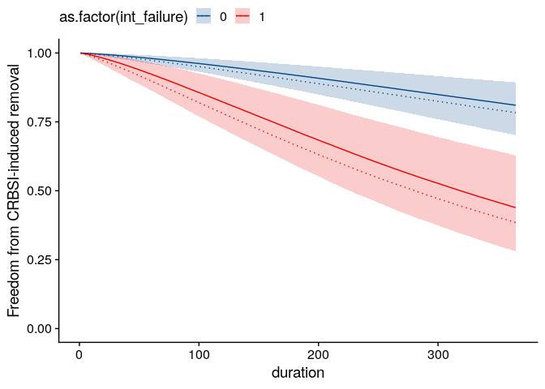

カテーテルデータの解析<br>*~ 個人差を考慮した生存時間解析 ~*
================
2021-03-11

## はじめに

近藤先生のデータを解析します。

後述しますが、生存時間解析の中で個人差をきちんと考慮したモデル、つまりベイズ階層モデルで生存時間解析を行ってみようと思います。

## データ

近藤先生より頂いたExcelファイル、`catheter.xlsx` の `2009-2017 Broviac Hickman
疾`というシートを読み込みます。

きちんとすべてに目を通してはいませんが、364行、71列のデータのようです。

## データ加工

今回は患者ID(`id`)、カテーテル挿入期間(`duration`)と転機(感染の有無)(`infection`)、背景疾患が腸管不全であるかどうか(`int_failure`)、を使って解析してみます。そのままでは疾患背景ごとに観察期間が違うので、挿入後1年間(365日)までとします。

なお、`id`は実際の患者IDではなく、本データ内での通し番号にします。 また、腸管不全ではない患者はすべて、悪性腫瘍の背景に揃えます。

データを加工し頭6行だけ表示してみます。とてもシンプルなテーブルデータになりました。

    # A tibble: 6 x 4
         id int_failure duration infection
      <dbl>       <dbl>    <dbl>     <dbl>
    1     1           1      365         0
    2     1           1      365         0
    3     2           1      365         0
    4     2           1      365         0
    5     3           0      268         0
    6     4           1      316         1

なお、欠損データを含む行を削除すると、226行、4列になりました。患者数は144です。
以後、このテーブルデータを解析に使います。

## 可視化と“普通の”統計解析

カテーテル挿入期間`duration`とカテーテル感染症`infection`をアウトカムとした生存時間解析が主題ですので、まずはKaplan-Meier
Curveを描いてみます。

<!-- -->

腸管不全の有無`int_failure`で2群に分けると以下のようになります。 CRBSI感染までの時間について両群に差がありそうです。

<!-- -->

Log-Rank検定では2群のCRBSI発生までの時間に有意差ありと出ました。

    Call:
    survdiff(formula = Surv(duration, infection) ~ int_failure, data = df)
    
                    N Observed Expected (O-E)^2/E (O-E)^2/V
    int_failure=0 146       18     37.3      10.0      26.3
    int_failure=1  80       43     23.7      15.8      26.3
    
     Chisq= 26.3  on 1 degrees of freedom, p= 3e-07 

同様に、Cox比例ハザード回帰でも腸管不全群で感染がおこりやすいものと推定されます(ハザード比約3.8)

    Call:
    coxph(formula = Surv(duration, infection) ~ int_failure, data = df)
    
                  coef exp(coef) se(coef)     z        p
    int_failure 1.3458    3.8414   0.2822 4.769 1.85e-06
    
    Likelihood ratio test=25.51  on 1 df, p=4.397e-07
    n= 226, number of events= 61 

## 問題点

しかし、以下のグラフを見ると上記結果の解釈には慎重になる必要があります。
サンプル数が、“患者数”ではなく“カテーテルの数”であり、同一患者が複数回エントリーしていることが重要です。

CRBSI発生の多い患者ほど、観察期間中に何回もエントリーしていると予想されますから、腸管不全の群ではCRBSIを短期間に何度も起こした患者の影響が全体のデータに強く反映されており、CRBSIの発生が過大に評価されていると危惧されます。

<!-- -->

そこで上述のような“事情”を十分に調整した形で、2つの群を比べてみたくなりますが、それには「個人差を組み込んだ」統計モデリングが必要になってきます。

具体策として「ベイズ階層モデル」を作っていく訳ですが、その理論的背景についてはばっさり割愛します。[このあたりのサイト](https://www.bananarian.net/entry/2018/11/20/120000)になぜこのような統計モデルが必要かが解説してあります。ご参照ください。

また、ベイズ統計モデリングではシンプルなモデルから少しずつ複雑にしていくことがとても肝要です。したがってここでも、いきなり最終モデルを提示するのではなく、step-by-stepに順次モデルを複雑にしていくことにします。

## モデル1: パラメトリックなモデル

Kaplan-Meier法やLog-Rank検定、Cox比例ハザード回帰モデルといった、“普通の”統計手法はすべて、“セミノンパラメトリック”と呼ばれる方法です。

一方で、ベイズモデリングではすべてのデータとパラメーターを確率分布で表現する必要があります(つまり“パラメトリック”です)。

そこで、まずはKaplan-Meier法から離れて、“パラメトリックな”手法で生存期間を表現していこうと思います。
生存時間解析で用いられる事の多い、Weibull分布を用いた生存期間の表現を試していきます。

Stanの記述は以下の通りです。Weibull分布を用いた生存時間解析、および打ち切りの取り扱いなどについては、[こちらのサイト](https://ajhjhaf.hatenablog.com/entry/2017/08/05/194939)をご参照ください。

``` stan
data {
  int N;                   // nrow(df)
  int duration[N];         // df$duration
  int infection[N];        // df$infection 
  int N_new;               // length(1:max(df$duration)) * 2
  int duration_new[N_new]; // rep(1:max(df$duration), 2)
}

parameters {
  real shape;
  real scale;
}

model {
  for (n in 1:N) {
    if (infection[n] == 0) {
      target += weibull_lccdf(duration[n] | shape, scale);
    } else {
      target += weibull_lpdf(duration[n] | shape, scale);
    }
  }
}

generated quantities {
  vector[N_new] pred; 
  for (n in 1:N_new) {
    pred[n] = 1 - weibull_cdf(duration_new[n], shape, scale);
  }
}
```

MCMCサンプリングは約30秒くらいでさくっと終わりました。

実際には収束診断や推定パラメーターの分布をひとつずつ確認していく作業が必須なのですが、ここではすべて省略します。

さて、推定パラメータをもとに近似した生存曲線は以下のようになります。 少々K-M
Curve(点線)とずれがありますが、観察期間とサンプルサイズを考えるとこんなものでしょうか。

<!-- -->

## モデル2: Weibull回帰モデル

続いて、共変量を表現しましょう。
つまり、腸管不全の有無という変数を用いた回帰モデルにします。

Stanの記述は以下のようになります。ここでも[こちらのサイト](https://ajhjhaf.hatenablog.com/entry/2017/08/05/194939)の解説が参考になります。

``` stan
data {
  int N;                        // nrow(df)
  int duration[N];              // df$duration
  int infection[N];             // df$infection 
  int int_failure[N];           // df$int_failure
  int N_new;                    // length(1:max(df$duration)) * 2
  int duration_new[N_new];      // rep(1:max(df$duration), 2)
  int int_failure_new[N_new];   // c(rep(1, max(df$duration)), rep(2, max(df$duration)))
}

parameters {
  real shape;
  real beta[2];
}

model {
  for (n in 1:N) {
    if (infection[n] == 0) {
      target += weibull_lccdf(duration[n] | shape, exp(-(beta[1] + int_failure[n]*beta[2]) / shape));
    } else {
      target += weibull_lpdf(duration[n] | shape, exp(-(beta[1] + int_failure[n]*beta[2]) / shape));
    }
  }
}

generated quantities {
  vector[N_new] pred; 
  real scale[2]; 
  for (n in 1:N_new) {
    pred[n] = 1 - weibull_cdf(duration_new[n], shape, exp(-(beta[1] + int_failure_new[n]*beta[2]) / shape));
  }
  for (i in 1:2) {
    scale[i] = exp(-(beta[1] + (i-1)*beta[2]) / shape); 
  }
}
```

MCMCサンプリングですが、こちらも約40秒ほどで速やかに終わりました。

推定されたパラメータをもとに近似した生存曲線が以下になります(点線がK-M Curve)。悪くない感じではないでしょうか。

<!-- -->

さて、このような回帰(比例ハザード回帰)分析で知りたいのはハザード比ですが、本モデルにおいてHazard ratio (95% CI) は
3.68 (2.32 - 6.93)
でした。

これは、腸管不全でCRBSIが起こりやすいことを示しています。また、95%信用区間が1をまたがないため、有意であると判断されます。なお、ベイズ統計に基づいた区間推定では、“信頼区間”という用語を使いません。また、この区間の意味するところも全く異なります。このあたりの詳細については、[こちらのサイト](https://ai-trend.jp/basic-study/bayes/bayes_interval_estimation/)をご参照ください。

ここまでで、K-M法やCox比例ハザード回帰を用いた手法を、Weibull回帰でなぞることができたことになります。

## モデル3: 個人差を考慮したモデル

さて、実際にはここからが本番です。個人差をモデルに含めていきます。
腸管不全あり、なしの両群に、“平均的な”生存時間というのが存在していて、各々の患者はそれぞれその周囲でばらついているという想定です。

Stanの記述は以下の通りです。

``` stan
data {
  int N;                        // nrow(df)
  int duration[N];              // df$duration
  int infection[N];             // df$infection 
  int int_failure[N];           // df$int_failure
  int id[N];                    // df$id
  int N_id;                     // max(df$id)
  int N_new;                    // length(1:max(df$duration)) * 2
  int duration_new[N_new];      // rep(1:max(df$duration), 2)
  int int_failure_new[N_new];   // c(rep(0, max(df$duration)), rep(1, max(df$duration)))
}

parameters {
  real<lower=0> shape;
  real beta;
  real beta_if; 
  real<lower=0> beta_id; 
  vector[N_id] r_id;
}

transformed parameters {
  vector[N] scale; 
  for (n in 1:N) { 
    scale[n] = exp(-(beta + int_failure[n]*beta_if + r_id[id[n]]*beta_id) / shape);  
  }
}

model {
  for (n in 1:N) {
    if (infection[n] == 0) {
      target += weibull_lccdf(duration[n] | shape, scale[n]);
    } else {
      target += weibull_lpdf(duration[n] | shape, scale[n]);
    }
  }
  r_id ~ normal(0, 1); 
}

generated quantities {
  vector[N_new] pred; 
  for (n in 1:N_new) {
    pred[n] = 1 - weibull_cdf(duration_new[n], shape, exp(-(beta + int_failure_new[n]*beta_if) / shape));
  }
}
```

サンプリングは50秒くらいかかりました。

先ほどと同様に、推定されたパラメータをもとに近似した生存曲線が以下になります(点線がモデル2による近似)。両群ともに、生存曲線が右上方にシフトしました。

特に腸管不全の方でシフト幅が大きいようですが、当初予想した通りです。
腸管不全の群では、繰り返しエントリーのCRBSIを繰り返す症例により大きく足を引っ張られたデータになっていたものと考えられます。

<!-- -->

さて本モデルでは、Hazard ratio (95% CI) は 3.9 (1.97 - 8.07)
であり、腸管不全でCRBSIが起こりやすいことを示しています。また、95%信用区間が“1”をまたがないため、有意であると判断されます。

つまり、個人差をモデルに入れて、複数エントリーの症例によるデータの偏重に対し調整を試みたうえでなお、腸管不全でCRBSIが起こりやすいことを示すことができました。
